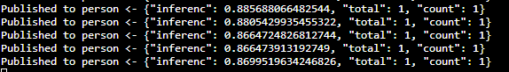
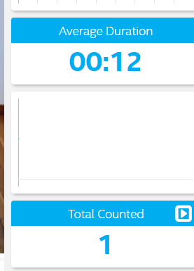
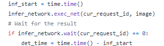
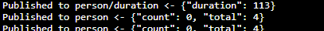
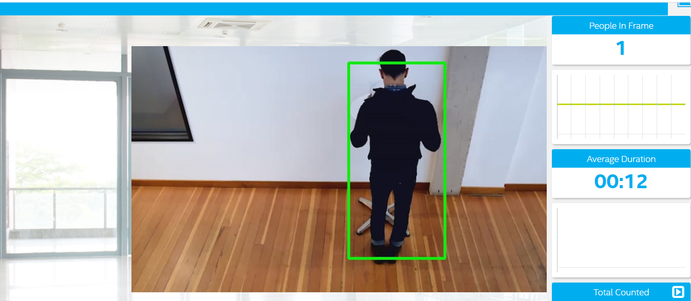
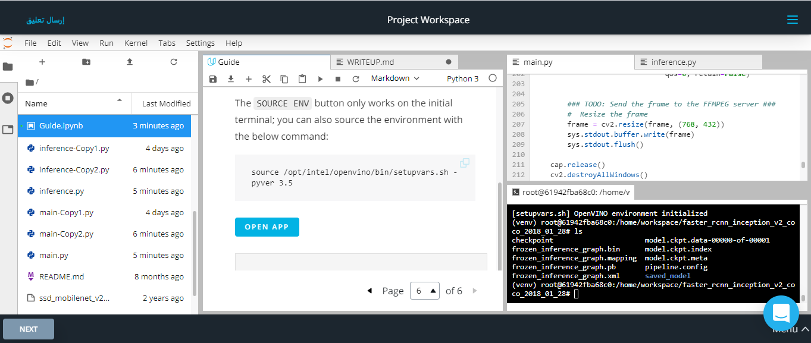
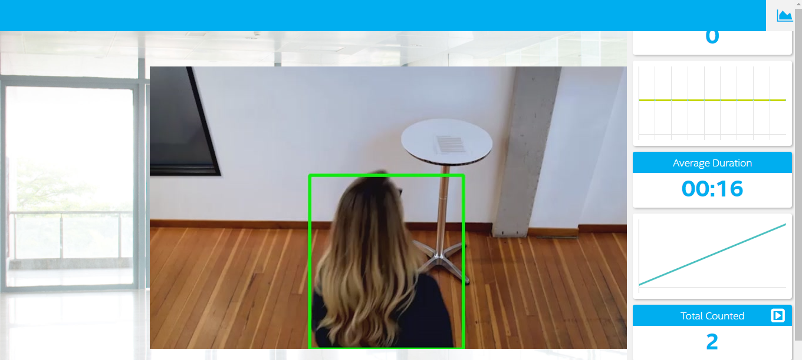

# Project Write-Up

after reseaching and applying different methods.
the model cant be from INTEL models, my choice was to get the model from Tensorflow, then do the model optimizer process in order to make it  Intermediate Representation (IR) to fit the format of openvino.
the final model been used in this project is : faster_rcnn_inception_v2_coco_2018_01_28
## the process of model optimizer is here
*download link is here for the model
```
wget
http://download.tensorflow.org/models/object_detection/faster_rcnn_inception_v2_coco_2018_01_28.tar.gz
```
* Extracting the tar.gz and then cd to the file of the model
```
tar -xvf faster_rcnn_inception_v2_coco_2018_01_28.tar.gz
```
```
cd faster_rcnn_inception_v2_coco_2018_01_28
```
*the command line for converting to (IR)
```
python /opt/intel/openvino/deployment_tools/model_optimizer/mo.py --input_model frozen_inference_graph.pb --tensorflow_object_detection_api_pipeline_config pipeline.config --reverse_input_channels --tensorflow_use_custom_operations_config /opt/intel/openvino/deployment_tools/model_optimizer/extensions/front/tf/faster_rcnn_support.json
```
* to run the app use this 
```
python main.py -i resources/Pedestrian_Detect_2_1_1.mp4 -m /home/workspace/faster_rcnn_inception_v2_coco_2018_01_28/frozen_inference_graph.xml -l /opt/intel/openvino/deployment_tools/inference_engine/lib/intel64/libcpu_extension_sse4.so -d CPU -pt 0.6 | ffmpeg -v warning -f rawvideo -pixel_format bgr24 -video_size 768x432 -framerate 24 -i - http://0.0.0.0:3004/fac.ffm
```

## Explaining Custom Layers

The process behind converting custom layers involves comparing the frameworks like tensorflow, caffee and others.

In tensorflow : 
- First step_ register the Custom layers as extensions for model optimizer 
- Second step_ replace all unsupported subgraph with different subgraph, which will offload the computation of the subgraph in inference.

for other frameworks like Caffee:
- First step_ register the Custom layers as extensions for model optimizer ( same as Tensorflow)
- Second step_ register the layers as custom then calculate the output shape of the layer by using caffee seteps.

Some of the potential reasons for handling custom layers are:
- Optimize our pre-trained models and convert them to (IR) without lossing the accuracy
- Shrik and speed up the performace of the (IR)
- In case of not supported layers the Model Optimizer automatically classifies as supported custom layer
- To play the code without ERROR Flag of  unsupported layer from the inference engine

CHECK THE LINK FOR MORE : (https://docs.openvinotoolkit.org/2019_R3/_docs_MO_DG_prepare_model_customize_model_optimizer_Customize_Model_Optimizer.html)

## Comparing Model Performance

The final model used in this project is **Faster_rcnn_inception_v2_coco_2018_01_28**
My method(s) to compare models before and after conversion to Intermediate Representations
were:
checking the Latency (microseconds) and Memory (Mb)

The difference between model accuracy pre- and post-conversion was:pre- was higher than the model
The size of the model pre- and post-conversion was: post-conversion to (IR) was smaller than the model pre-conversion
The inference time of the model pre- and post-conversion was: pre-conversion longer time comparing to post-conversion
| Model/Framework                             | Latency (microseconds)            | Memory (Mb) |
| -----------------------------------         |:---------------------------------:| -------:|
| ssd_mobilenet_v2_coco_2018_03_29           | 451                              | 387    |
| Faster_rcnn_inception_v2_coco_2018_01_28    | 1279                              | 562    |
| faster_rcnn_inception_v2_coco from OpenVINO    | 891                              | 281    |


* Its clear after using these models there is change and different in term of decreasing in the latency.

* Model inference time
 In the main function,my method in comparing the performance of models using accuracy and speed along with checking the **inference time*
 in the code I have implement to check time.time() during inference request to compare the models.

 *the output of inference time in terminal for faster_rcnn_inception_v2_coco_2018_01_28
 
 
 *app duration app
 
 
 *app duration app using faster_rcnn_inception_v2_coco_2018_01_28
 
## Assess Model Use Cases

Some of the potential use cases of the people counter app are:
- This modle will help in cutomer journey follow inside retails
- Managing the footfall inside malls 
- Analyis the people duration in key touch points like front-office in stadiums,meusums and others
-Many other places to be use in like banks,libraries, resturants, and others 

Each of these use cases would be useful because:
- We will have a good visual and controll of the people moving inside spaces 
- We will have initial data to improve the cutomer flow and benifit the business owners to make valiable decisions.

Details examples implementation:
- In case of using in a public area with the help of adding another model like poster estimation direction, we can collect data of people stopping and looking to a certain area or stopping in front of ads, using the analyzed data we can benefit the retails area of what people were interested in during their visit to this locations 
- In using this type of app in *stadiums: the app can have stream live video from key touchpoints around the stadiums like the ticketing area and food and beverages line for ordering, the app will calculate the duration of each user according to the data taken and from that data, we can have full strategy analysis system to enhance future improvements in the stadium 


## Assess Effects on End User Needs

Lighting, model accuracy, and camera focal length/image size have different effects on a
deployed edge model. The potential effects of each of these are as follows:
- the needed accurate result needed to be taken from cheking various models and their output accuracy.
-the length/image size has an effect on the reading, as good size and quality will get good detection and fast response of the app during the detection period needed
- edge application need good pre-implementation process on term of choosing the right focal in camera nad the angle used as this will have impact of easier mass application in industrial or public use.

## Model Research

[This heading is only required if a suitable model was not found after trying out at least three
different models. However, you may also use this heading to detail how you converted 
a successful model.]

In investigating potential people counter models, I tried each of the following three models:

- Model 1: [Faster_rcnn_inception_v2_coco_2018_01_28] from tensoflow model
  - [https://github.com/tensorflow/models/blob/master/research/object_detection/g3doc/detection_model_zoo.md]
  - I converted the model to an Intermediate Representation with the following arguments:
  
   - ```tar -xvf faster_rcnn_inception_v2_coco_2018_01_28.tar.gz```
    - ```cd faster_rcnn_inception_v2_coco_2018_01_28.tar.gz```
    - ```python /opt/intel/openvino/deployment_tools/model_optimizer/mo.py --input_model frozen_inference_graph.pb --tensorflow_object_detection_api_pipeline_config pipeline.config --reverse_input_channels --tensorflow_use_custom_operations_config /opt/intel/openvino/deployment_tools/model_optimizer/extensions/front/tf/faster_rcnn_support.json```
  - it is so slow in working inside the virtual workspace 
 -  the numbers are accurate and good enough as it counted the total number of people correctly 
  
- Model 2: [ssd_mobilenet_v2_coco_2018_03_29]
  - [http://download.tensorflow.org/models/object_detection/ssd_mobilenet_v2_coco_2018_03_29.tar.gz]
  - I converted the model to an Intermediate Representation with the following arguments:
  
    - ```tar -xvf ssd_mobilenet_v2_coco_2018_03_29.tar.gz```
    - ```cd ssd_mobilenet_v2_coco_2018_03_29```
    - ```python /opt/intel/openvino/deployment_tools/model_optimizer/mo.py --input_model frozen_inference_graph.pb --tensorflow_object_detection_api_pipeline_config pipeline.config --reverse_input_channels --tensorflow_use_custom_operations_config /opt/intel/openvino/deployment_tools/model_optimizer/extensions/front/tf/ssd_v2_support.json```
    
  - the counted numbers in the model cant be fixed to the person to detect - the app works only yo detect the person in the fist frame and when it move only - the result is not accurate as the total people counted is 33
  - I tried to improve it by cutting layers but didnt work

- Model 3: [ssd_inception_v2_coco_2018_01_28]
  - [http://download.tensorflow.org/models/object_detection/ssd_inception_v2_coco_2018_01_28.tar.gz]
  - I converted the model to an Intermediate Representation with the following arguments:
      - ```tar -xvf ssd_inception_v2_coco_2018_01_28.tar.gz```
    - ```cd ssd_inception_v2_coco_2018_01_28```
    - ```python /opt/intel/openvino/deployment_tools/model_optimizer/mo.py --input_model frozen_inference_graph.pb --tensorflow_object_detection_api_pipeline_config pipeline.config -- reverse_input_channels --tensorflow_use_custom_operations_config /opt/intel/openvino/deployment_tools/model_optimizer/extensions/front/tf/ssd_v2_support.json```
  - The model was insufficient for the app because it fsiled to detect the people in the frame
  - I didnt try to improve it as it didnt give the needed output at the first to enhance it
  
  According to udaicty Reviewer he give me this : tips:You can add person-detection-retail-0013 - FP16 and FP32 to test the final accurate result.
  after testing the given recommanded model the result is like magic, perfect and smooth detection and good performance in term of calculations and desired output.
  --------------------------------------
## screenshot of the app

## screenshot of the app

## screenshot of the app 2

## screenshot of the app 3



